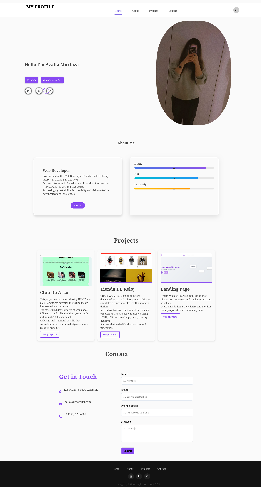

#  **Profile - Azalfa Murtaza**
 
 

A clean, modern, and responsive portfolio website built with pure HTML, CSS, and JavaScript. This frontend-only  website showcases professional skills, projects, and provides a contact form with a thank you page confirmation.

 
  
 

  

 
 

-----

**Features**

**1.Responsive Design:** Optimized for all screen sizes 
**2.Dark Mode Toggle:** Easy switch between light and dark modes  
**3.Interactive UI:** Smooth scrolling and interactive elements 
**4.Skills Visualization:** Progress bars to showcase proficiency levels 
**5.Project Showcase:** Gallery of completed projects with descriptions 
**6.Working Contact Form:** Frontend form validation with thank you page confirmation

 
 

------
**Sections**
 
 

**Header & Navigation**
 
Clean navigation menu with Home, About, Projects, and Contact links 
Personal branding with name and profile picture 
Social media links for easy connection 
Hire Me and Download CV buttons for quick actions 

 
 

----

**About Me**

 
Professional introduction with description of web development expertise 
Skills visualization with progress bars for HTML, CSS, and JavaScript 

 
 

---

**Projects**
 
Project cards showcasing various web development work 
Each project includes:
 

**Project thumbnail**
**Project title**
**Description of technologies used and features implemented**
**"View Project" button for more details**

 
 

---

**Featured Projects:**
 

**Club De Arco:** Development project using HTML5 and CSS3 with standardized folder structure and component design
**Tienda DE Reloj:** Online watch store with interactive features and optimized user experience
**Landing Page:** Dream wishlist web application for creating and tracking personal goals

---

**Contact**

Contact form with fields for: 

Name 
Email 
Phone number 
Message 

Form validation to ensure proper input 
Submit button that directs to a thank you confirmation page 

-----

**Thank You Page**

Confirmation message upon successful form submission 
"Back to Home" button for easy navigation 
Same navigation menu as main page for consistency 

 
 
 

-----

**The following technologies have been used for its realisation:**

 
  
  
  
  
